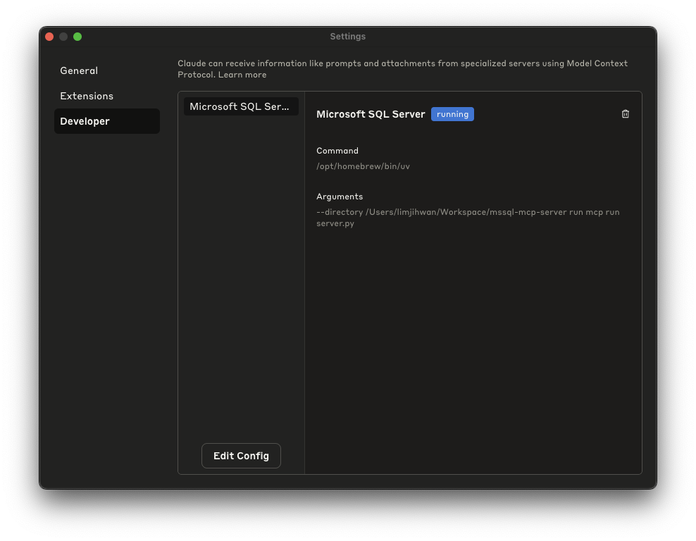
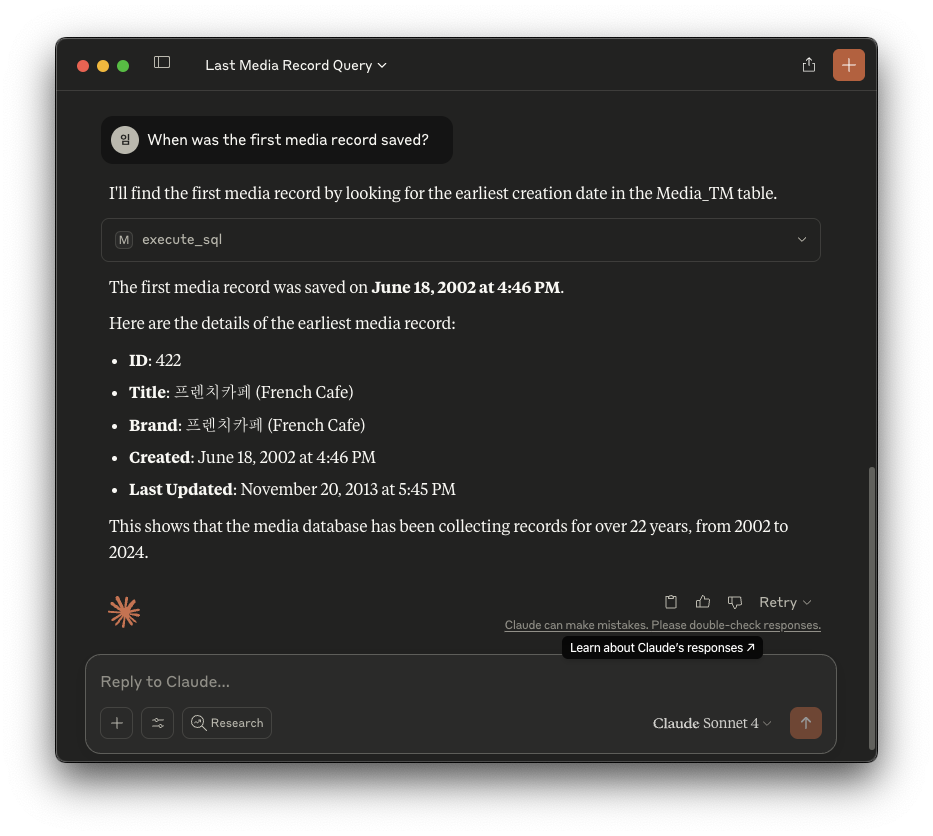

# MSSQL MCP Server


## Prerequisites

- [uv](https://github.com/astral-sh/uv)
- [Claude Desktop](https://claude.ai/download)


## How To Set Up

1. Copy `.env.example` to `.env` and edit `.env`.
2. Open `claude_desktop_config.json` and add the following lines:
    > You should replace `/path/to/` with your actual path.
    ```json
    {
        "mcpServers": {
            "Microsoft SQL Server": {
                "command": "/opt/homebrew/bin/uv",
                "args": [
                    "--directory",
                    "/path/to/mssql-mcp-server",
                    "run",
                    "mcp",
                    "run",
                    "server.py"
                ]
            }
        }
    }
    ```
3. Restart your Claude Desktop.
4. Verify the server is successfully running.
    


### For Claude Code

```
claude mcp add-from-claude-desktop
```


## Example


